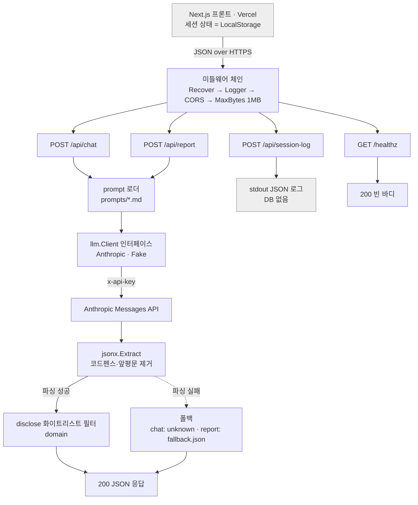

# girugi

취준생 **직무체험 시뮬레이션 플랫폼**의 백엔드 API 서버.
사용자가 제품디자이너 역할로 AI 관계자와 대화하며 산출물을 작성하는 웹 서비스(해커톤 MVP).

- 프론트엔드는 Next.js(별도 레포). **모든 세션 상태는 브라우저 LocalStorage**에 있고,
  이 서버는 **상태를 저장하지 않습니다(stateless)**.
- 외부 의존성은 **LLM API 하나**. **DB 없음. Go 표준 라이브러리만** 사용.

지원 시나리오 2개:

| `scenario` | 내용 | 관계자 | 리포트 |
|---|---|---|---|
| `cmf_outsourcing` | CMF 선정 · 외주업체 컨택 | senior · engineering · purchasing · design | 3분류(strengths/cautions/missed) |
| `prototype_revision` | 프로토타입 수정, 3라운드 협상 | senior · engineering · design | 5섹션 서술형 |

---

## 아키텍처

### 요청 흐름



> 핵심: 모든 LLM 응답은 `jsonx.Extract` 를 거치고, 파싱 실패해도 **500이 아니라 200 + 폴백**.
> `disclose` 는 프롬프트를 믿지 않고 `domain` 화이트리스트로 코드에서 필터링.

### 디렉토리 구조

```
.
├── cmd/server/main.go        엔트리포인트: 설정·배선·graceful shutdown
├── internal/
│   ├── config/               환경변수 로드 (DB 없음)
│   ├── domain/               시나리오·페르소나·disclose 화이트리스트
│   ├── httpx/                CORS·로깅·panic복구·바디제한 미들웨어, JSON 헬퍼
│   ├── jsonx/                LLM 응답에서 JSON 객체 추출(코드펜스·앞평문 제거)
│   ├── llm/                  Client 인터페이스 + Anthropic 구현 + Fake
│   ├── prompt/               prompts/ 파일 로더
│   ├── chat/                 POST /api/chat
│   ├── report/               POST /api/report (+ fallback.go)
│   └── sessionlog/           POST /api/session-log
├── prompts/                  ★ AI·기획 담당 영역 (코드 변경 없이 수정)
│   ├── personas/             세션2: senior·engineering·purchasing·design
│   ├── s1_personas/          세션1: senior·engineering·design
│   ├── report.md · s1_report.md
│   └── fallback.json         finding code → 폴백 문장, _s1_default
├── docs/API.md               프론트 연동용 API 레퍼런스
├── API.md                    프론트-백 계약 원본(최우선)
├── BACKEND_SPEC_v4.md        구현 명세
├── CLAUDE.md                 작업 규칙
└── Dockerfile
```

### 설계 원칙

- **Stateless / No DB** — 세션 상태는 프론트 LocalStorage. `session-log` 도 stdout 로깅뿐.
- **표준 라이브러리만** — 라우터·ORM·LLM SDK 없음. `net/http` 메서드 라우팅, `log/slog`.
- **LLM은 문장 다듬기 전용** — 분기 판정·채점은 프론트에서 끝난 상태로 전달. 서버·LLM은 재분류하지 않음.
- **프롬프트는 데이터** — Go 소스에 하드코딩 금지. `prompts/` 에서 런타임 로드(기획이 수정).
- **disclose 화이트리스트는 코드에서 강제** — 프롬프트 준수만 믿지 않고 `domain.FilterDisclose` 로 필터.
- **폴백 우선** — LLM 응답 파싱 실패는 500이 아니라 200 + 폴백. 대화·리포트가 절대 끊기지 않음.
- **외부 호출은 인터페이스 뒤** — `llm.Client` 를 테스트에서 `Fake` 로 교체(실제 API 호출 테스트 없음).

---

## 실행

### 로컬

```bash
# API 키 없이도 기동됨 (/healthz 200, LLM 호출만 503, report는 폴백 200)
go run ./cmd/server

# 실제 LLM 사용 (기본 provider = openai)
OPENAI_API_KEY=sk-... ALLOWED_ORIGIN=http://localhost:3000 go run ./cmd/server
# Anthropic로 전환: LLM_PROVIDER=anthropic ANTHROPIC_API_KEY=sk-ant-...
```

### Docker

```bash
docker build -t girugi:dev .
docker run -p 8080:8080 \
  -e OPENAI_API_KEY=sk-... \
  -e ALLOWED_ORIGIN=https://your-frontend \
  girugi:dev
# 포트 변경: -e PORT=9000 -p 9000:9000 (이미지 재빌드 불필요)
```

prompts/ 는 이미지에 포함되어 `/prompts` 에서 로드됩니다(`PROMPTS_DIR=/prompts`).

### 환경변수

| 변수 | 기본 | 필수 | 설명 |
|---|---|---|---|
| `PORT` | `8080` | X | 바인드 포트 |
| `HOST` | (전체) | X | 바인드 주소. 비우면 모든 인터페이스(컨테이너 기본) |
| `LLM_PROVIDER` | `openai` | X | `openai` \| `anthropic`. 프롬프트가 GPT-4o 튜닝이라 기본 openai |
| `OPENAI_API_KEY` | — | X* | provider=openai일 때 필요. 없으면 LLM 호출만 503 |
| `ANTHROPIC_API_KEY` | — | X* | provider=anthropic일 때 필요 |
| `MODEL` | provider별 | X | 미설정 시 openai→`gpt-4o`, anthropic→`claude-haiku-4-5-20251001` |
| `ALLOWED_ORIGIN` | `*` | O(프로덕션) | CORS 허용 오리진. 프로덕션은 실제 오리진 지정 |
| `PROMPTS_DIR` | `./prompts` | X | 프롬프트 파일 경로 |

---

## 엔드포인트

| 엔드포인트 | 역할 | LLM |
|---|---|---|
| `POST /api/chat` | 관계자 답변 생성 + 의도 분류 | O |
| `POST /api/report` | 배정된 finding을 문장으로 변환 | O |
| `POST /api/session-log` | 체험 종료 로그(stdout) | X |
| `GET /healthz` | 헬스체크(200 빈 바디) | X |

상세 요청/응답/에러는 [`docs/API.md`](docs/API.md).

## 문서

- [`docs/API.md`](docs/API.md) — 프론트 연동용 API 레퍼런스
- [`docs/CODE_WALKTHROUGH.md`](docs/CODE_WALKTHROUGH.md) — 코드 읽는 순서 + 예상 Q&A
- [`docs/DEPLOYMENT.md`](docs/DEPLOYMENT.md) — 이미지 빌드 → 레지스트리 → 클라우드/K8s 배포

---

## 개발

```bash
go vet ./...
go test ./...          # 모든 LLM 호출은 Fake — 실제 API 호출 테스트 없음
```

새 핸들러는 Fake LLM 기반 테이블 테스트를 함께 작성합니다. `go vet` · `go test` 통과가 커밋 조건.

### 프롬프트 / AI 파트

`prompts/` 내용(페르소나 보유정보, 폴백 문구 등)은 AI·기획 담당이 채웁니다.
코드 변경 없이 파일만 수정하면 반영됩니다 — 남은 항목은 GitHub Issues(`ai-part` 라벨) 참고.
